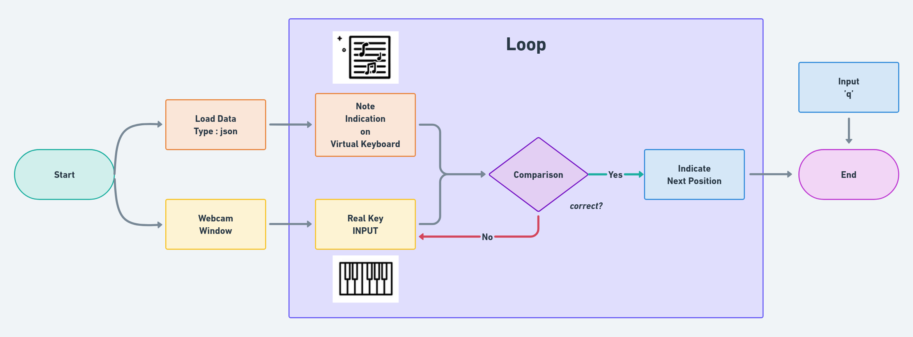

# 낙원상가(Paradise Store)
#### 본 프로젝트는 초보자를 위한 피아노 학습 보조 프로그램입니다.
 
#### 사용자가 연주하고자하는 악보에 대한 건반 안내를 가상건반에서 제공하고
#### AI 모델로 학습된 건반 계이름 인식 데이터를 활용하여 비교하여 
#### 실시간으로 안내하고, 올바른 연주 피드백을 제공합니다.
---
# Flow Chart

# High Level Design
# Sequence Diagram
# Class Diagram
---
### #주요 기능
---
#### 1. 저장된 악보 데이터 가상건반에 하이라이트
    저장된 악보 파일(.json)을 오픈하면 가상 건반에 하이라이트.
    연주하고자 하는 악보의 건반 위치를 안내.    
    
#### 2. 악보 데이터와 인식된 건반의 데이터를 비교.
    웹캠으로 디스플레이 되고 있는 건반에서
    학습된 데이터를 통해 건반 위의 손을 인식하여
    어떤 계이름의 건반을 누르는지 확인하고
    가상 건반에서 지시하는 악보 데이터와 비교.

#### 3. AR 피드백 제공
    올바른 건반을 누르면 다음 건반으로 하이라이트 이동.
    틀린 건반을 누를 경우 피드백 제공.

---
### #기술 설계
---
#### 1. 프론트엔드
##### - UI 프레임워크
    PyQt5를 사용하여 직관적인 사용자 인터페이스 구축.
##### - 카메라 입력
    OpenCV를 활용해 웹캠 화면 처리.
##### -  AR 표시
    서로 매칭되는 건반과 악보의 음표를 HIGHLIGHT

#### 2.  백엔드
##### - 손 위치 추적
    Object Detection 모델을 이용한 건반 위의 손가락을 인식
##### - 건반 매핑
    사용자 손 위치를 가상 건반의 지시된 건반 데이터와 매핑

---
### #설치 및 실행 방법
---
#### 1. 환경 설정
    
#### 2. 주요 패키지
    
#### 3. 실행

---
### #시스템 요구사항
---
#### 1. 카메라:
    웹캠 (USB 3.0, RAW 파일 전송 지원) 권장.
#### 2. 조명 조건: 충분한 밝기.
#### 3. 캘리브레이션: 초기 설정 시 카메라와 피아노 건반의 거리 조정 필요.

---
### #참고자료
---
    Roboflow Tutorial
    OpenCV AR Tutorial
  
